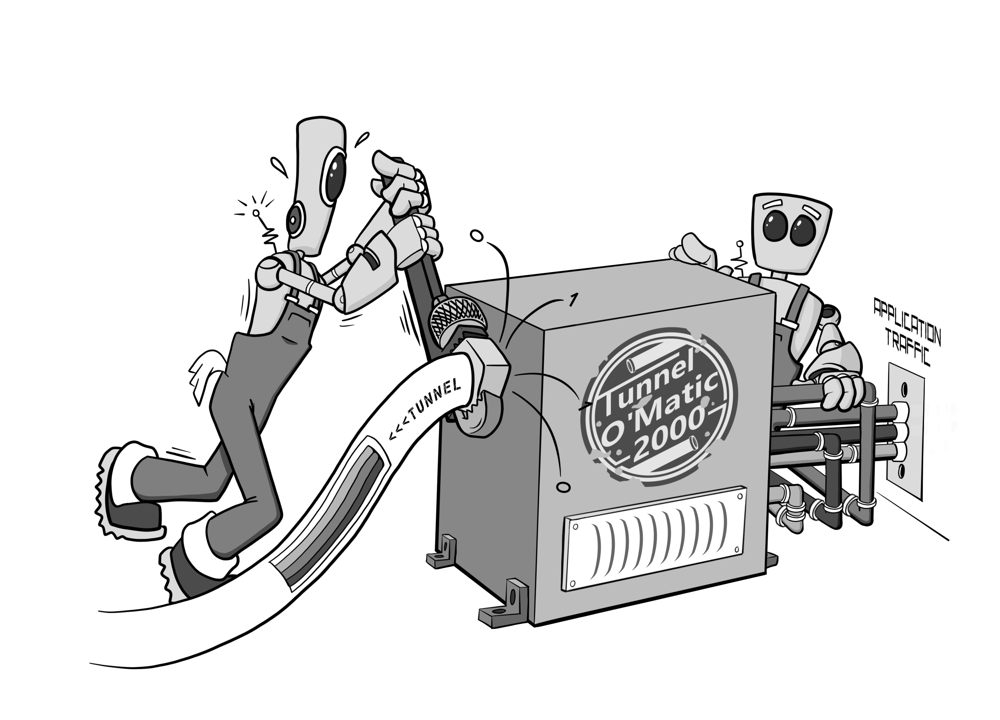
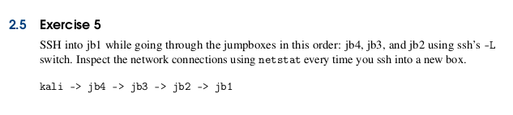
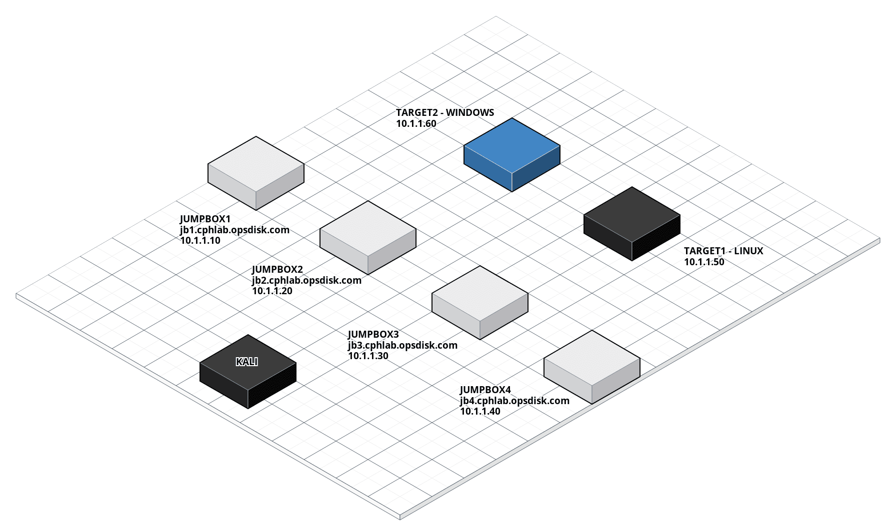

# The Cyber Plumber's Handbook

This repo contains the PDF book **The Cyber Plumber's Handbook - The definitive guide to Secure Shell (SSH) tunneling,
port redirection, and bending traffic like a boss**.  The book was first published in October 2018 for purchase, but now
I'm providing it for **FREE** to anyone interested in learning more about the magic of SSH tunnels and port redirection.

## Book Overview

This book is packed with practical and real world examples of SSH tunneling and port redirection in multiple realistic
scenarios. It walks you through the basics of SSH tunneling (both local and remote port forwards), SOCKS proxies, port
redirection, and how to utilize them with other tools like proxychains, nmap, Metasploit, and web browsers.

Advanced topics included SSHing through 4 jump boxes, throwing exploits through SSH tunnels, scanning assets using
proxychains and Metasploit's Meterpreter, browsing the Internet through a SOCKS proxy, utilizing proxychains and nmap
to scan targets, and leveraging Metasploit's Meterpreter portfwd command.

## Getting Started

1) Agree to the terms of the Creative Commons Attribution-NonCommercial 4.0 International [License](./LICENSE.md) which
is also outlined [here](https://creativecommons.org/licenses/by-nc-nd/4.0/).

2) Download the latest PDF from [here](cph_version_1.4_20210829.pdf).

3) Purchase the **The Cyber Plumber's Lab Guide and Interactive Access** from
[here](https://opsdisk.gumroad.com/l/cphlab).  Your purchase includes a PDF lab guide with **45+ exercises** and **28**
days of interactive access to a real live lab to practice SSH tunneling and port redirection techniques!

## Interactive Lab

The Cyber Plumber's Lab Guide and Interactive Access can be purchased [here](https://opsdisk.gumroad.com/l/cphlab).

### Why purchase?

**SSH tunneling is a skill you can use for the rest of your IT career!** SSH tunneling and port redirection are skills
that can be applied in any information technology discipline, so it does not matter if you are a network engineer, red
teamer, penetration tester, developer, or something in between.  That being said, the examples tend to skew towards
pairing tunneling techniques with penetration testing tools.

### Lab Description

Four jump boxes provide the Internet facing portion of the lab.  However, the fun really starts when you start
leveraging tunneling techniques to reach the internal side of the network to access services such as Secure SHell (SSH),
Web, and Remote Desktop Protocol (RDP).  The Linux and Windows targets are also running vulnerable services that can be
exploited for the true tunneling ninjas. Each of the exercises has a brief description and solution to assist you in the
event you get stuck.

### Requirements

The interactive lab portion requires a Linux-based host or virtual machine (preferably Kali), Internet access, a basic
grasp of networking and Information Technology fundamentals, and Linux commands.  The use of a Windows Operating System
to access the lab has not been tested.  Immediately after purchasing this, you will receive an SSH private key via email
and instructions on how to access the lab.  **Your lab time starts immediately after purchasing, so plan accordingly!**

### Testimonial

> After your course, I have been able to:
>
> 1) Stand-up a cloud-hosted Kali box, configure OpenVAS, ssh into the box...all encrypted yet run on my local browser.
> I no longer have to bother with installing VNC.
>
> 2) Same thing with Dradis...allows a penetration testing team to collaborate on an assignment without having to mess
> with certificates.
>
> 3) I wrote a script that launches 10 VMs in DigitalOcean in seconds, then I ssh into them with -D 9050...9059. I have
> 10 entries in my proxychains.conf file for 127.0.0.1 9050...127.0.0.1 9059, and then launch theHarvester with
> proxychains. Google no longer accuses me of being a bot.
>
> 4) I passed a tip along to a network engineer at my company that he should read your book rather than exposing an
> administrative login page on a public facing website.
>
> 5) For privacy, I sometimes create a VM on the fly and use it as a proxy in Firefox."

### Bulk / Team Pricing

The purchase of the lab guide and access is for individual use only.  If you are interested in bulk or team pricing for
your organization, please contact me using [here](mailto:cph@opsdisk.com).  Access keys cannot be shared and your lab
access will be immediately revoked without a refund if you are discovered doing this.

## FAQ

1) What if I find a error / typo?

    Submit a issue [here](https://github.com/opsdisk/cyber_plumbers_handbook_free/issues)

2) Will you open source the [LaTeX](https://en.wikipedia.org/wiki/LaTeX) files?

    Maybe

## Contact

* [Email](mailto:cph@opsdisk.com)
* [@opsdisk](https://twitter.com/opsdisk)

## License

Distributed under the Creative Commons Attribution-NonCommercial 4.0 International License. See `LICENSE.md` for more
information.

 This work is licensed under a <a rel="license" href="http://creativecommons.org/licenses/by-nc/4.0/">Creative Commons Attribution-NonCommercial 4.0 International License</a>.
